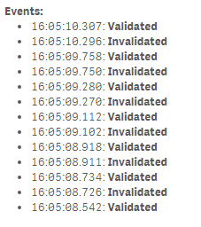

# Angular-Events
> Events in AngularJS based visualization extensions.

## Purpose and Description
Example how to use events in AngularJS based visualization extensions.

Have a look at the source file to see usage of the following events:

* **Validated** - The data has been recalculated and new valid data is available.
* **Invalidated** - The data has been invalidated, for example by a user selection. Do not use the data.
* **Aborted** - Calculation has been aborted.
* **Cancelled** - Calculation has been cancelled.
* **Closed** - Connection to the Qlik engine has been closed for this object.

[Official documentation](http://betahelp.qliktech.com/sense/2.0/en-US/developer/Subsystems/Mashups/Content/Howtos/mashups-access-visualization-data.htm)

## Screenshot

## Installation

1. Download the latest version
2. Qlik Sense Desktop
	* To install, copy all files in the .zip file to folder "C:\Users\[%Username%]\Documents\Qlik\Sense\Extensions\Angular-Events"
3. Qlik Sense Server
	* See instructions [how to import an extension on Qlik Sense Server](http://help.qlik.com/sense/en-us/developer/#../Subsystems/Workbench/Content/BuildingExtensions/HowTos/deploy-extensions.htm)

## Usage

* Open your browser's web developer tools (e.g. Chrom Web Dev Tools) and watch in the console output when events are triggered.

## Author

**Stefan Walther**

## Change Log

See [CHANGELOG](CHANGELOG.yml)

## License & Copyright
The software is made available "AS IS" without any warranty of any kind under the MIT License (MIT).

See [Additional license information for this solution.](LICENSE.md)

